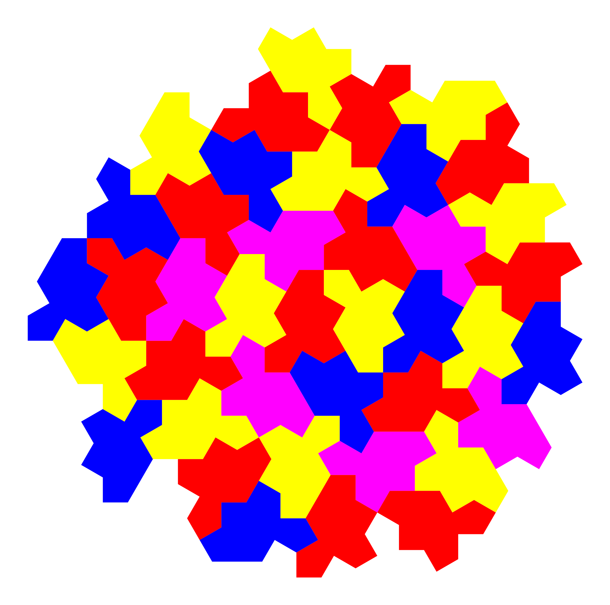
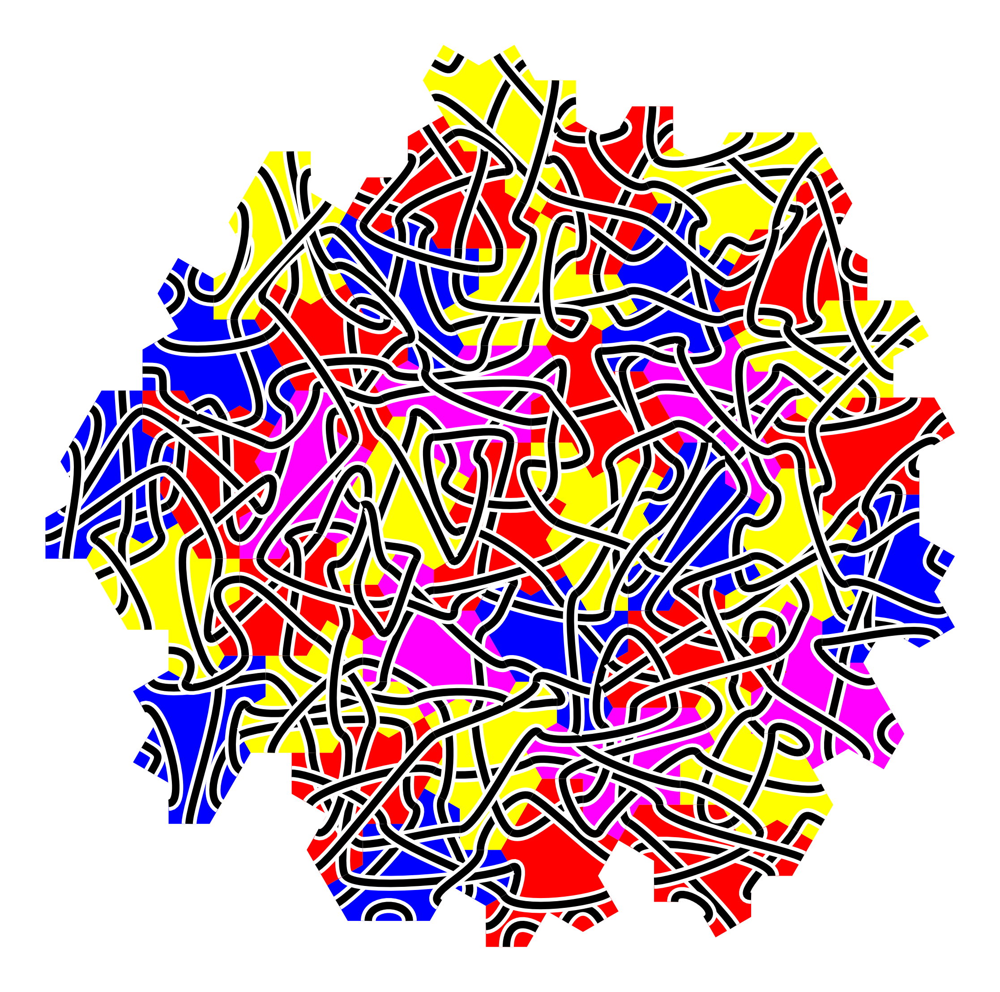

# Celtic Knot from Einstein Tiling.

## Installation

```
pip install numpy matplotlib python-sat
```

## Run

```
python einstein.py
```

Without the rope, we have a four coloring:



Here's one random celtic knot on this tiling:

